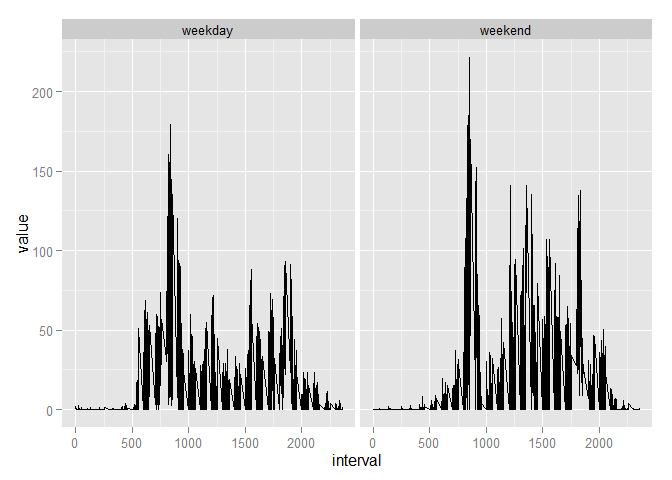

# Reproducible Research: Peer Assessment 1


## Loading and preprocessing the data

### 1.uzip the file


### 2.read data

```r
if(!exists("activity.csv")){
      unzip(zipfile = "activity.zip") #uzip zip file   
}
dat=read.csv(file="activity.csv",header = T,sep = ",",
         stringsAsFactors = F) #read data
dat$date=as.POSIXct(dat$date) #change date colume type
str(dat)
```

```
## 'data.frame':	17568 obs. of  3 variables:
##  $ steps   : int  NA NA NA NA NA NA NA NA NA NA ...
##  $ date    : POSIXct, format: "2012-10-01" "2012-10-01" ...
##  $ interval: int  0 5 10 15 20 25 30 35 40 45 ...
```

```r
head(dat)
```

```
##   steps       date interval
## 1    NA 2012-10-01        0
## 2    NA 2012-10-01        5
## 3    NA 2012-10-01       10
## 4    NA 2012-10-01       15
## 5    NA 2012-10-01       20
## 6    NA 2012-10-01       25
```


## What is mean total number of steps taken per day?

### 1. Calculate the total number of steps taken per day

```r
tmp=dat[complete.cases(dat),] #without NA

# Calculate the total number of steps taken per day
tapply(tmp$steps,tmp$date,sum)
```

```
## 2012-10-02 2012-10-03 2012-10-04 2012-10-05 2012-10-06 2012-10-07 
##        126      11352      12116      13294      15420      11015 
## 2012-10-09 2012-10-10 2012-10-11 2012-10-12 2012-10-13 2012-10-14 
##      12811       9900      10304      17382      12426      15098 
## 2012-10-15 2012-10-16 2012-10-17 2012-10-18 2012-10-19 2012-10-20 
##      10139      15084      13452      10056      11829      10395 
## 2012-10-21 2012-10-22 2012-10-23 2012-10-24 2012-10-25 2012-10-26 
##       8821      13460       8918       8355       2492       6778 
## 2012-10-27 2012-10-28 2012-10-29 2012-10-30 2012-10-31 2012-11-02 
##      10119      11458       5018       9819      15414      10600 
## 2012-11-03 2012-11-05 2012-11-06 2012-11-07 2012-11-08 2012-11-11 
##      10571      10439       8334      12883       3219      12608 
## 2012-11-12 2012-11-13 2012-11-15 2012-11-16 2012-11-17 2012-11-18 
##      10765       7336         41       5441      14339      15110 
## 2012-11-19 2012-11-20 2012-11-21 2012-11-22 2012-11-23 2012-11-24 
##       8841       4472      12787      20427      21194      14478 
## 2012-11-25 2012-11-26 2012-11-27 2012-11-28 2012-11-29 
##      11834      11162      13646      10183       7047
```

### 2.  Make a histogram of the total number of steps taken each day

```r
#Make a histogram of the total number of steps taken each day
library(plyr) #load plyr
```

```
## Warning: package 'plyr' was built under R version 3.1.2
```

```r
per_day_steps=ddply(.data = tmp,.variables = .(date),.fun = summarize,per_day_step=sum(steps))

#  Make a histogram of the total number of steps taken each day
library(ggplot2)
```

```
## Warning: package 'ggplot2' was built under R version 3.1.2
```

```r
library(scales)
```

```
## Warning: package 'scales' was built under R version 3.1.2
```

```r
g=ggplot(data = per_day_steps,aes(x=date,y=per_day_step))
g+geom_histogram(stat="identity")
```

 

### 3.  Calculate and report the mean and median of the total number of steps taken per day

```r
#mean of the total number of steps taken per day
per_day_mean_steps=ddply(.data = tmp,.variables = .(date),.fun = summarize,per_day_step=mean(steps))
head(per_day_mean_steps)
```

```
##         date per_day_step
## 1 2012-10-02      0.43750
## 2 2012-10-03     39.41667
## 3 2012-10-04     42.06944
## 4 2012-10-05     46.15972
## 5 2012-10-06     53.54167
## 6 2012-10-07     38.24653
```

```r
#median of the total number of steps taken per day
per_day_median_steps=ddply(.data = tmp,.variables = .(date),.fun = summarize,per_day_step=median(steps))
head(per_day_median_steps)
```

```
##         date per_day_step
## 1 2012-10-02            0
## 2 2012-10-03            0
## 3 2012-10-04            0
## 4 2012-10-05            0
## 5 2012-10-06            0
## 6 2012-10-07            0
```


## What is the average daily activity pattern?

### 1.Make a time series plot (i.e. type = "l") of the 5-minute interval (x-axis) and the average number of steps taken, averaged across all days (y-axis)

```r
df_interval=ddply(tmp,.(interval),summarize,mean_steps=mean(steps))
g1=ggplot(data = df_interval,aes(x=interval,y=mean_steps))
g1+geom_point()
```

 

### 2.Which 5-minute interval, on average across all the days in the dataset, contains the maximum number of steps?

```r
df_interval=ddply(tmp,.(interval),summarize,max_step=max(steps))
g2=ggplot(data = df_interval,aes(x=interval,y=max_step))
g2+geom_point()
```

 

```r
#print the max one
df_interval[which.max(df_interval$max_step),]
```

```
##    interval max_step
## 76      615      806
```

## Imputing missing values

### 1. the total number of rows with NAs  
the total number of rows with NAs2304

```r
nrow(dat)-nrow(tmp)
```

```
## [1] 2304
```

### 2.  filling in all of the missing values in the dataset  

```r
dat[is.na(dat$steps),]$steps=median(tmp$steps)
new_dat=dat
```


### 3.   Calculate and report the mean and median total number of steps taken per day 

```r
total_steps=ddply(.data = new_dat,.variables = .(date),.fun = summarize,all_step=sum(steps))
#Make a histogram 

g4=ggplot(data = total_steps,aes(x=date,y=all_step))
g4+geom_histogram(stat="identity")
```

 

```r
new_mean_steps=ddply(.data = new_dat,.variables = .(date),.fun = summarize,new_mean_step=mean(steps))
head(new_mean_steps)
```

```
##         date new_mean_step
## 1 2012-10-01       0.00000
## 2 2012-10-02       0.43750
## 3 2012-10-03      39.41667
## 4 2012-10-04      42.06944
## 5 2012-10-05      46.15972
## 6 2012-10-06      53.54167
```

```r
#median of the total number of steps taken per day
new_median_steps=ddply(.data = new_dat,.variables = .(date),.fun = summarize,new_median_steps=median(steps))
head(new_mean_steps)
```

```
##         date new_mean_step
## 1 2012-10-01       0.00000
## 2 2012-10-02       0.43750
## 3 2012-10-03      39.41667
## 4 2012-10-04      42.06944
## 5 2012-10-05      46.15972
## 6 2012-10-06      53.54167
```


## Are there differences in activity patterns between weekdays and weekends?

### 1 .Create a new factor variable in the dataset with two levels – “weekday” and “weekend” i

```r
library(lubridate)
```

```
## Warning: package 'lubridate' was built under R version 3.1.3
```

```r
new_dat$wday=wday(new_dat$date)
bre=c(0,5,7)
new_dat$fact=cut(x = new_dat$wday,breaks = bre,labels = c("weekday","weekend"),include.lowest = F)
```


### 2. make plot

```r
intervals=ddply(.data = new_dat,.variables = .(fact,interval),.fun = summarize,median_steps=median(steps),mean_steps=mean(steps))
library(reshape2)
```

```
## Warning: package 'reshape2' was built under R version 3.1.2
```

```r
df_melt=melt(data = intervals,c("interval","fact"))
g5=ggplot(data = df_melt,aes(x=interval,y=value))
g5+geom_line()+facet_grid(. ~ fact)
```

 

